在介绍线性回归方程之前简单提一下监督学习，线性回归是监督学习的一种，监督学习就是通过一些训练集得到一个优化模型*h*，通过这个模型对新的输入变量x得到输出变量y，监督学习就是为了得到一个最理想的*h*模型。

 

# **线性回归方程**

在上面提到过优化模型*h*可以看成是输入*x*的函数，为了方便起见记为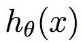，并假设该方程是关于*x*的连续函数，这是监督学习最为简单的一种。具体表达式如下所示：

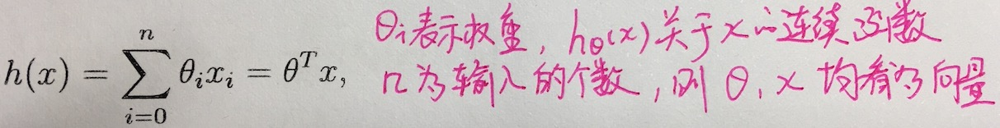

线性回归方程的目的就是使得尽可能的逼近于*y*，为了便于表示这种近似关系，定义误差方程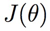:

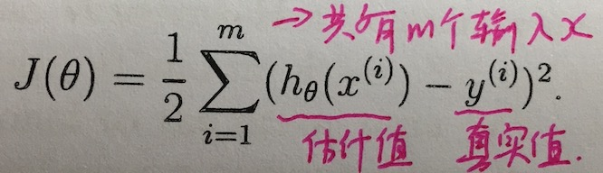

上述的表达式类似于最小均方值误差求解的方法，但是后面会给出数学上一般形式的表达方式。先做一个小结，上面主要讨论了在输入一些变量后求得的估计函数可以使后续的输入变量更加的接近真实值，这就是监督学习最简单的一种形式。

## **最小均方误差算法LMS**

LMS算法的目的就是如何选择权重使得达到最小值。**梯度下降算法**给出了一种求解的方法来使得误差方程最小。

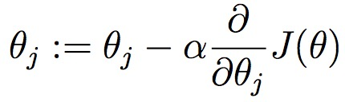

下面来求解关于的偏导。

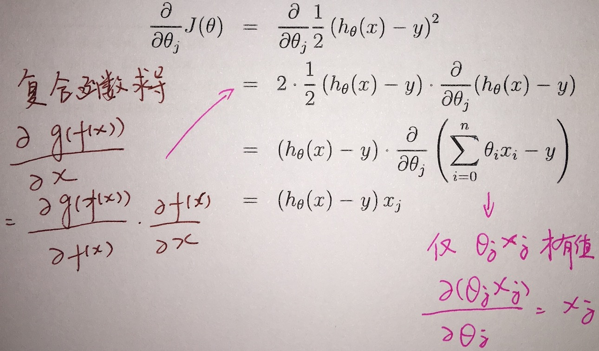

将求得的结果带入梯度下降算法得到结果。

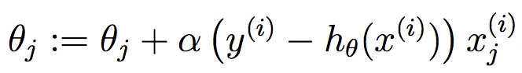

上述方程就是最小均方误差算法（LMS），这里仅仅是对一个特征量*j*来进行的计算，如果输入的*x*存在多个特征量就会有*{1,2...,j}*个那么就需要对上述算法进行改进。

### **batch梯度下降算法**

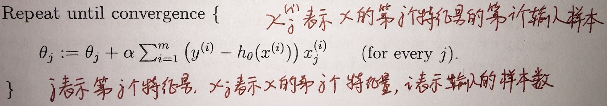

这个算法需要对输入量*x*的每个特征的参数更新都需要把所有的样本值计算一遍，这样梯度下降的结果总会收敛于一个整体的最小值。

### **incremental梯度下降算法**

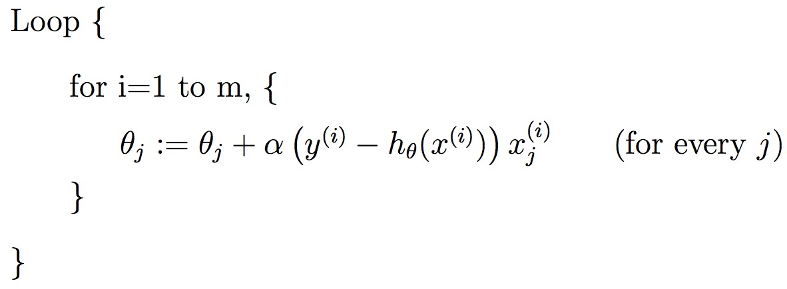

这个算法不需要把输入的相同特征的所有样本数都计算一遍，而是每输入一个样本值就会对进行更新。这样做的好处就是更加迅速的得到使误差函数达到最小值的参数，特别是在样本数量特别大的时候，该算法收敛速度更快。

## **常规方程**

LMS算法主要采迭代的方式得到使得误差方程收敛到最小值，常规方程的解法在于对每个得到的误差方程进行求导，并使其逼近0，得到一个收敛的最小结果。

### **数学基础**

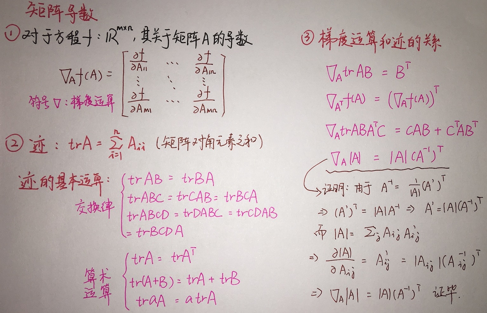

### **基于梯度矩阵的最小均方算法**

下面来考虑具体的实现算法，给定一组训练集合*X*，如何通过构造梯度矩阵来使误差函数达到收敛的最小值。

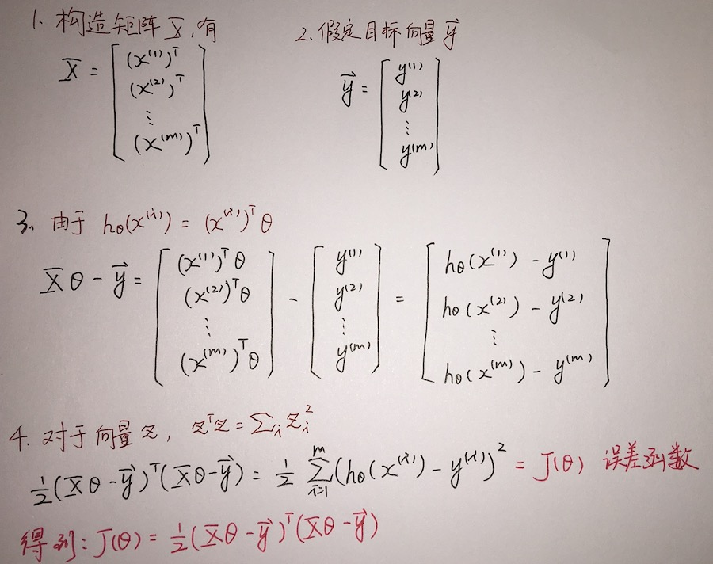

对上述结果进行梯度运算有：

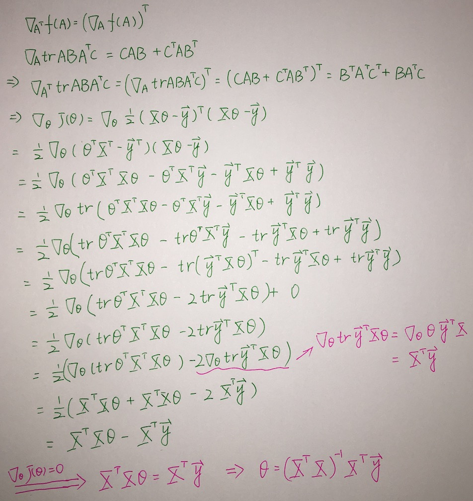

最终得到结果为：

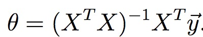

## **最大似然估计算法**

下面从统计概率的角度分析上述问题，首先定义输入和输出样本满足：

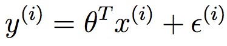

其中，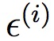为随机噪声误差，根据概率统计论可以将其分布看为高斯概率分布，即均方值为0，方差为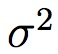，有如下表达式：

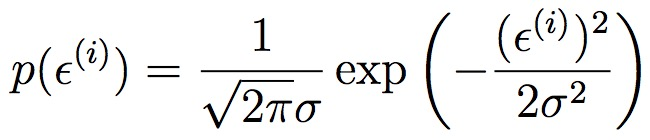

将定义公式带入上式得到：

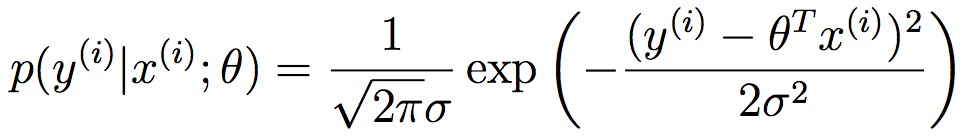

其中，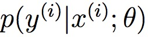表示定义参数下，在给定*x*时*y*出现的概率分布，记为：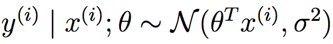。

按照在上一节的常规方程给出的方法，将输入的所有样本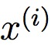构造成一个矩阵*X*，那么概率分布就可以表示为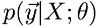，我们的目的是为了确定给定参数的时候，概率的分布情况，那也可以将概率分布看为是关于的函数，似然方程就是这么定义出来的。

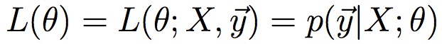

上述似然方程中*X*是一个样本矩阵，*y*也是矩阵向量，由于样本值是独立而且同分布的，那么就可以将似然函数改写为：

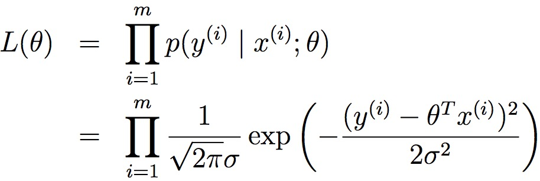

为了使得学习估计的结果更加精确，也就是输入的样本值*X*后，我们可以得到的结果和真实值更加的接近，应该使得概率分布函数的值达到最大，这就转换为如何确定参数使得似然函数达到最大值。上述方程为乘积的形式，对于数学处理过程显得不方便，为了简化函数的处理过程，对等式两边同时取对数，转换为加和的形式，方便后续处理。

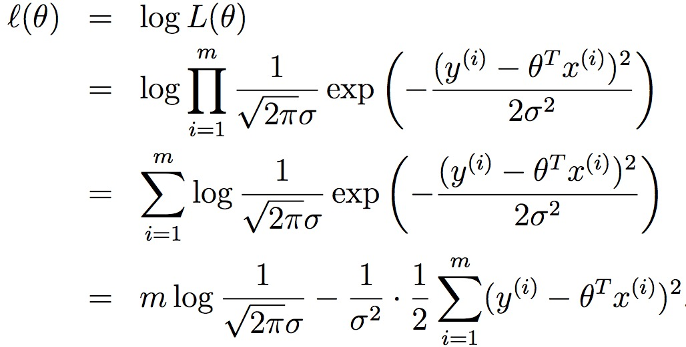

从上式可以看出为了使得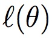达到最大值，应该使得下述方程达到最小值。

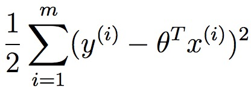

而上述方程正式我们之前求最小值时求得结果，一种隐藏的纽带将这几个方法的结果联系起来，后面会详细的讲解这种联系，并归纳出该类问题更加泛化的求解过程。同时注意到一个有意思的细节，也就是最大似然函数的结果并不依赖，虽然在之前的讨论中为了表达的方便而引入了这个参数。

## links
   * [目录](../../README.md)
   * 下一节: [Classification and Logistic Regression](../02-Classification-and-Logistic-Regression/Classification-and-Logistic-Regression.md)
