# **分类和逻辑回归**

线性回归方程包括LMS等算法主要解决连续值的问题，如果*y*是一些离散量，那么就需使用分类算法。下面来讨论一种简单的分类算法，估计结果*y*只有0和1两种结果，也可以认为将学习结果分类为TRUE和FALSE。

## **逻辑回归算法**

先采用之前处理连续分布值的方法来处理，由于*y*只有两种结果，那么就近似的将*y*的取值区间限定在[0,1]之间，sigmoid函数可以满足这些条件。

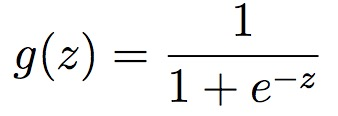

画出该函数的图像可以看出*y*的取值区间在0和1之间。

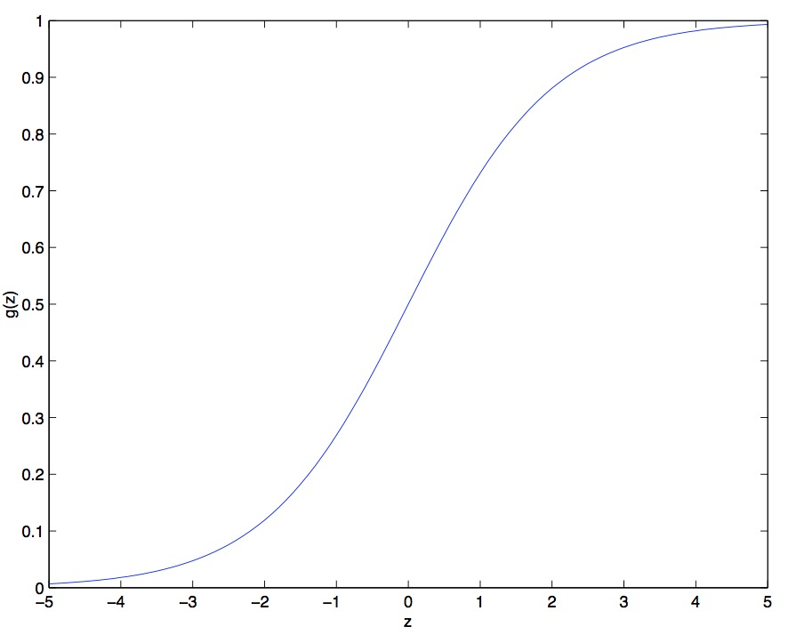

将之前的函数进行改写就可以改为：

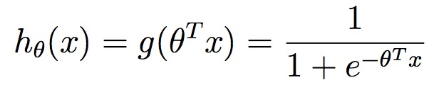

sigmoid函数还有一个性质：

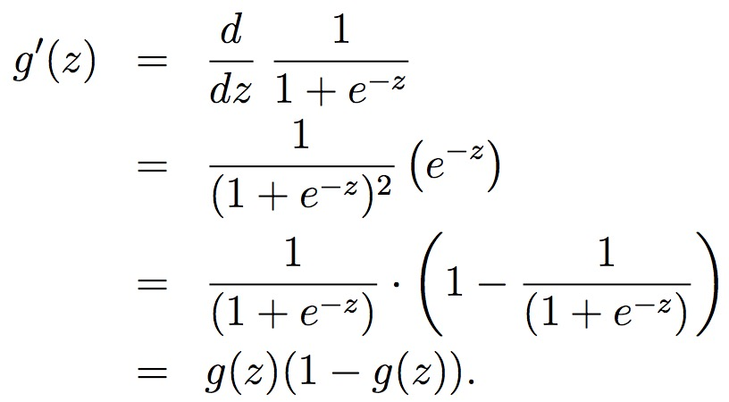

下面来研究如何应用逻辑回归算法。
1、确立模型方程（在后面可以看到更加具有普遍性的模型方程）。
2、确定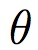的取值来使得模型方程具有最优的解。

### *确立模型方程*

由于估计结果只有0和1两种情况，条件概率分布如下所示：

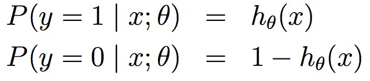

那么可以用伯努利分布来描述上述条件概率的分布模型：

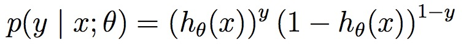

假设输入的m个样本为独立同分布，那么似然函数就可以表示为：

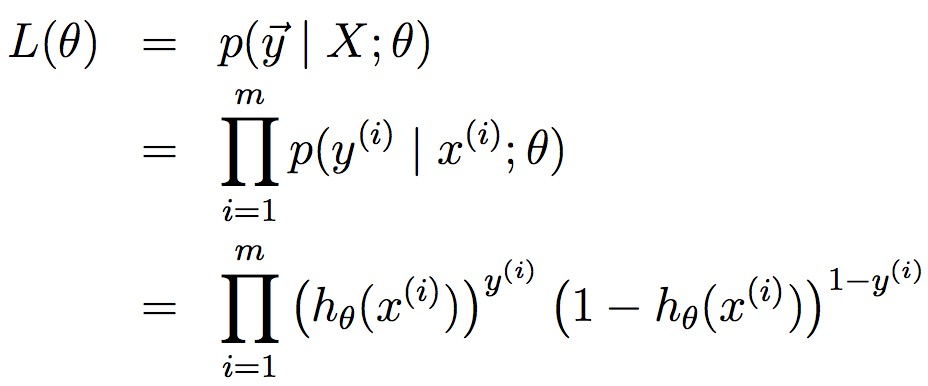

两边同时取对数可以得到最大似然函数的表示形式：

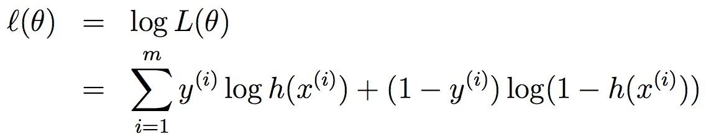

为了计算得到最大似然函数的取值，采用之前讨论的梯度下降算法来计算的取值。

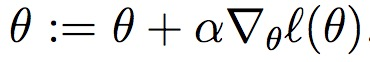

之所以改为“+”号是因为现在是计算方程的最大值，而不是之前计算的最小值。

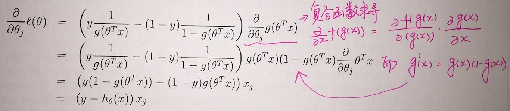

带入结果得到：

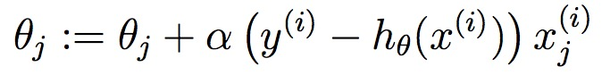

上述结果和LMS得到的结果基本一样，但是这里的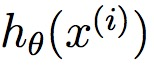是非线性的，上述结果的一致性并不是偶然的，后面会推导出更加具有普适性的方程族。

如果将*y*的值变为离散的：

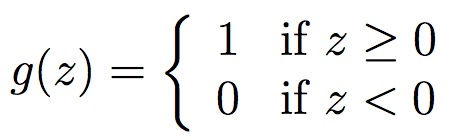

那么上述结果：

就称之为感知学习算法。

## links
   * [目录](../../README.md)
   * 上一节: [Linear Regression](../01-Linear-Regression/LMS-algorithm.md)
   * 下一节: [Generalized Linear Models](../03-Generalized-Linear-Models/Generalized-Linear-Models.md)
