# **广义线性模型**

之前讨论的高斯分布函数以及伯努利概率分布函数是属于广义线性模型（GLM）的特例，下面来具体讨论。

## **指数分布族**

为了更好的介绍GLMs，先来给出指数分布函数的表示：

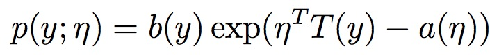

将高斯分布函数和伯努利概率函数改写为指数分布族的形式。

### *伯努利分布函数*

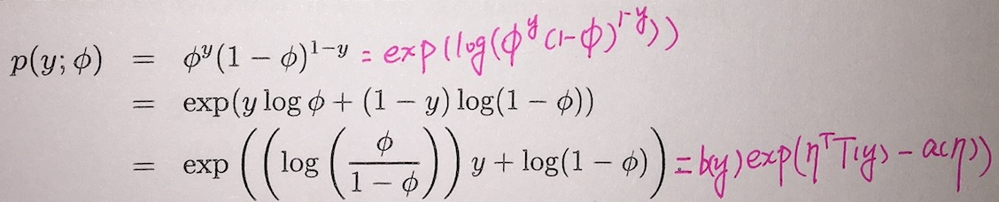

其中各个参数对应于指数分布族函数为：

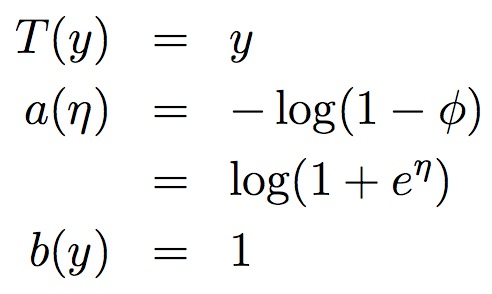

### *高斯概率分布函数*

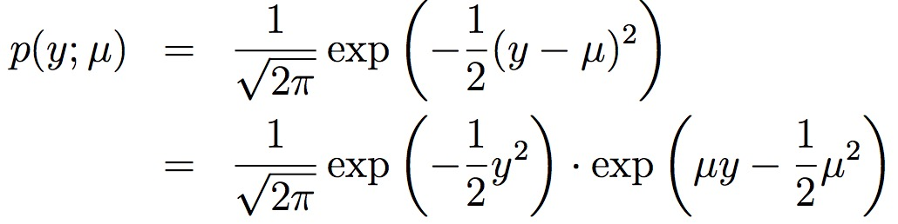

其中各个参数对应于指数分布族函数为：

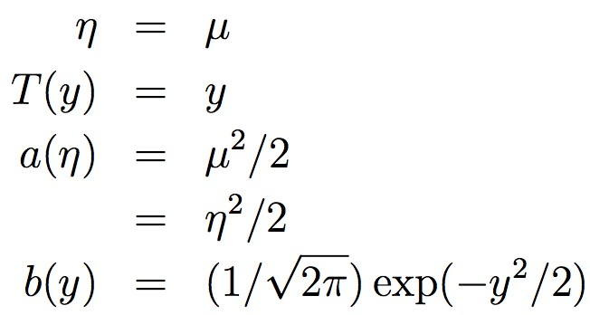

## **广义线性模型（GLMs）的构造方法**

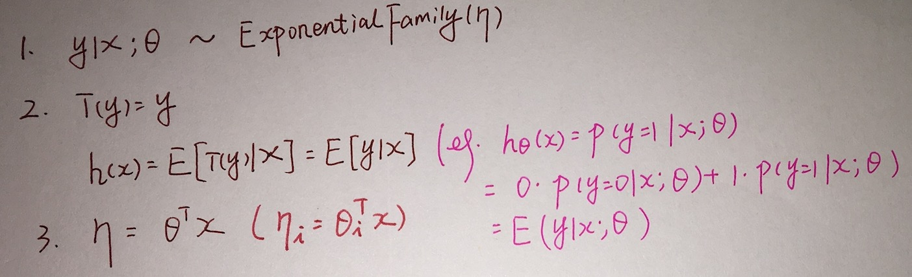

- 1、首先*x*和*y*要满足指数族分布。
- 2、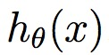可以通过期望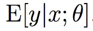来计算。
- 3、参数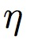和输入的样本*x*满足线性分布。

高斯概率分布函数

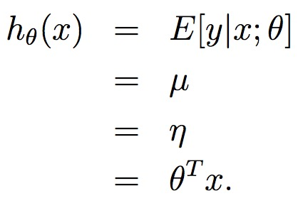

伯努利概率分布函数

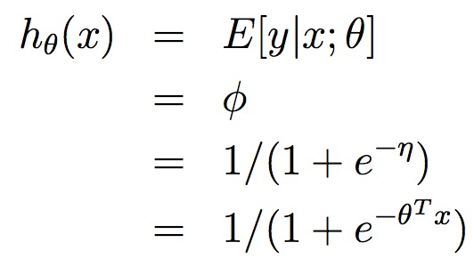

## **广义逻辑回归模型**

下面讨论一个具体的问题，多元分布概率模型，输入一定数量的样本值，将其分为多个类别{1,2,...,k}，下面就详细的讨论模型构造的过程。
本例子将输入样本值的估计分为三类，而不同于之前讨论的0和1

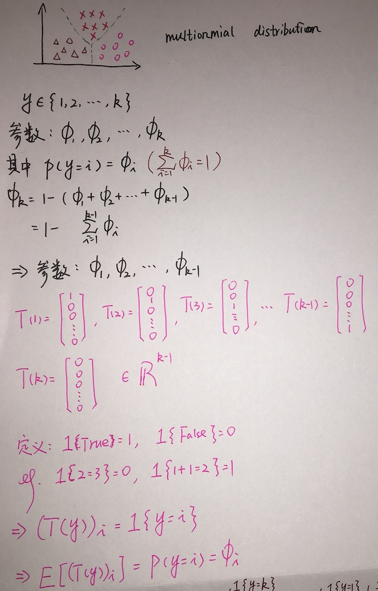

下面来对条件概率进行迭代求解

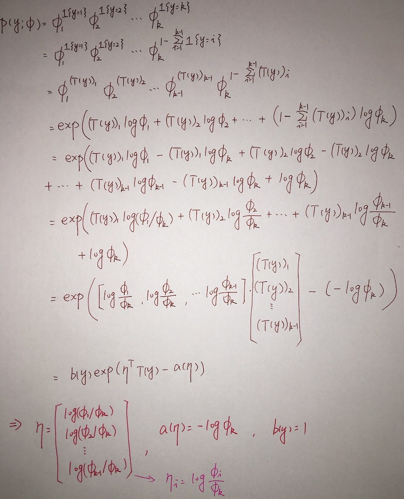

下面来求解GLMs模型中各个参数的值：

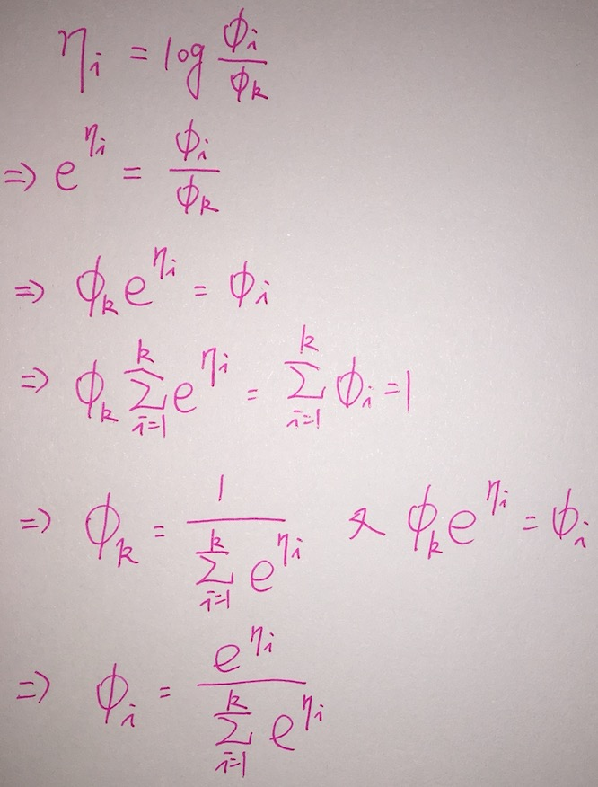

带入到条件概率中得到：

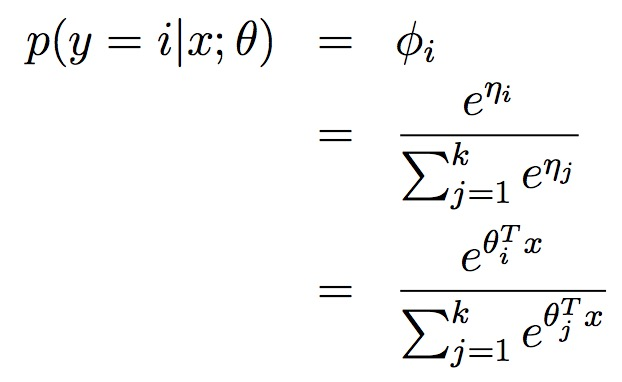

估计函数可以表示为：

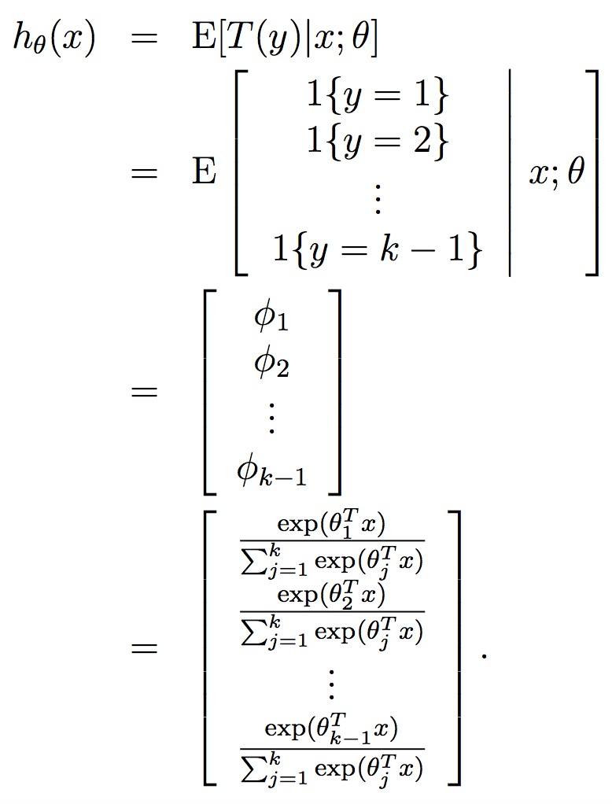

最大似然估计函数表示为：

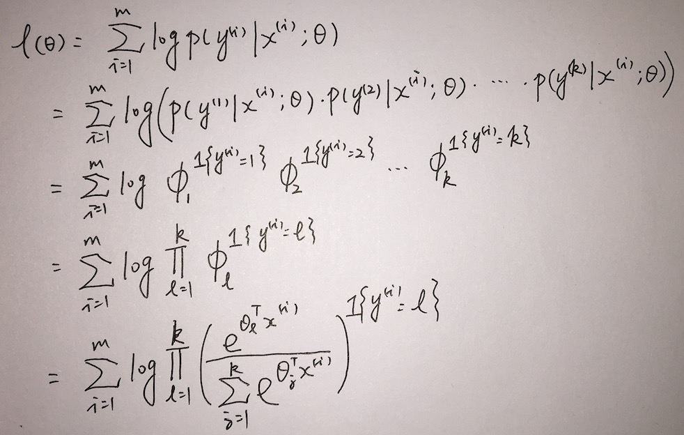

然后可以参照之前的梯度下降算法求得最大似然函数的取值。
具体数学推导过程如下所示：

## links
   * [目录](../../README.md)
   * 上一节: [Classification and Logistic Regression](../02-Classification-and-Logistic-Regression/Classification-and-Logistic-Regression.md)
   * 下一节: [Generative Learning Algorithms](../04-Generative-Learning-Algorithms/Generative-Learning-Algorithms.md)
